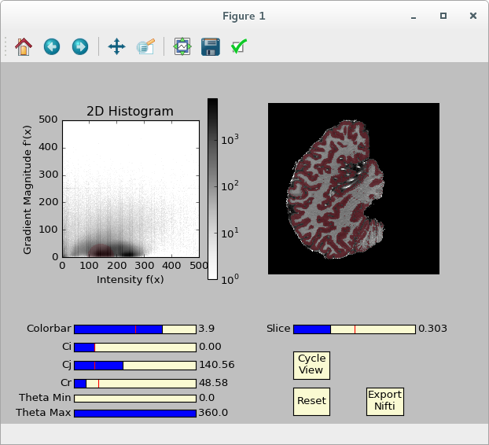

# Faruk added a line.

# Segmentator (work in progress)
Segmentator is an open-source package for multi-dimensional data exploration and segmentation purposes. This application is mainly developed for magnetic resonance imaging (MRI) brain data.

The goal is to provide a complementary tool to the already available tissue segmentation methods (to the best of out knowledge) in other softwares (FSL, Freesurfer, SPM, Brainvoyager, ITK-Snap).

This application is based the following work:

* Kindlmann, G., & Durkin, J. W. (1998). Semi-automatic generation of transfer functions for direct volume rendering. In Proceedings of the 1998 IEEE symposium on Volume visualization - VVS ’98 (pp. 79–86). New York, New York, USA: ACM Press. http://doi.org/10.1145/288126.288167

* Kniss, J., Kindlmann, G., & Hansen, C. (2001). Interactive volume rendering using multi-dimensional transfer functions and direct manipulation widgets. In Proceedings Visualization, 2001. VIS ’01. (pp. 255–562). IEEE. http://doi.org/10.1109/VISUAL.2001.964519

* Kniss, J., Kindlmann, G., & Hansen, C. (2002). Multidimensional transfer functions for interactive volume rendering. IEEE Transactions on Visualization and Computer Graphics, 8(3), 270–285. http://doi.org/10.1109/TVCG.2002.1021579

* Kniss, J., Kindlmann, G., & Hansen, C. D. (2005). Multidimensional transfer functions for volume rendering. Visualization Handbook, 189–209. http://doi.org/10.1016/B978-012387582-2/50011-3


## Dependencies

- [Python 2.7](https://www.python.org/download/releases/2.7/)
- [NumPy](http://www.numpy.org/)
- [matplotlib](http://matplotlib.org/)
- [NiBabel](http://nipy.org/nibabel/)


## How to use

Edit *"Load Data"* section in *segmentator_main.py* by giving the absolute path to your nifti data:

```
"""Load Data"""
nii = load('/run/media/ofgulban/Data/Segmentator_Datasets/Ingo/MPRAGE_T1.nii')
```

then open a terminal, navigate to Segmentator's folder (for instance: `cd /home/john/segmentator/` ) and type:

```
python segmentator_main.py
```

You should see something like this soon after:



More documentation is work in progress...

## Contributors

- Omer Faruk Gulban
- Marian Schneider
