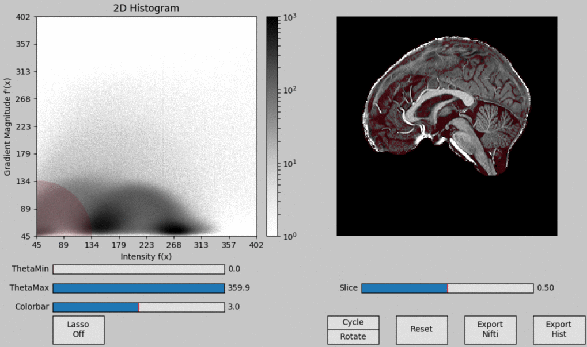

[](https://zenodo.org/badge/latestdoi/59303623) [](https://travis-ci.org/ofgulban/segmentator) [](https://ci.appveyor.com/project/ofgulban/segmentator) [](https://codecov.io/gh/ofgulban/segmentator) [](https://landscape.io/github/ofgulban/segmentator/master) [](https://gitter.im/segmentator/Lobby)

# Segmentator


Segmentator is a free and open-source package for multi-dimensional data exploration and segmentation for 3D images. This application is mainly developed and tested using ultra-high field magnetic resonance imaging (MRI) brain data.


The goal is to provide a complementary tool to the already available brain tissue segmentation methods (to the best of our knowledge) in other software packages (FSL, Freesurfer, SPM, Brainvoyager, itk-SNAP, etc.).

### Citation:
- Our preprint can be accessed from __[this link.](https://doi.org/10.1101/245738)__
- Released versions of this package can be cited by using our __[Zenodo DOI](https://zenodo.org/badge/latestdoi/59303623).__



## Core dependencies
**[Python 2.7](https://www.python.org/download/releases/2.7/)** or **[Python 3.6](https://www.python.org/downloads/release/python-363/)** (compatible with both).

| Package                                        | Tested version |
|------------------------------------------------|----------------|
| [matplotlib](http://matplotlib.org/)           | 2.0.2          |
| [NumPy](http://www.numpy.org/)                 | 1.13.1         |
| [NiBabel](http://nipy.org/nibabel/)            | 2.1.0          |
| [SciPy](http://scipy.org/)                     | 0.19.1         |
| [Compoda](https://github.com/ofgulban/compoda) | 0.3.3          |

## Installation & Quick Start
- Make sure you have [**Python 2.7**](https://www.python.org/download/releases/2.7/) and [**pip**](https://en.wikipedia.org/wiki/Pip_(package_manager)) installed.
- Download [the latest release](https://github.com/ofgulban/segmentator/releases) and unzip it.
- Change directory in your command line:
```
cd /path/to/segmentator
```
- Install the requirements by running the following command:
```
pip install -r requirements.txt
```
- Install Segmentator:
```
python setup.py install
```
- Simply call segmentator with a nifti file:
```
segmentator /path/to/file.nii.gz
```
- Or see the help for available options:
```
segmentator --help
```

Check out __[our wiki](https://github.com/ofgulban/segmentator/wiki)__ for further details such as [GUI controls](https://github.com/ofgulban/segmentator/wiki/Controls), [alternative installation methods](https://github.com/ofgulban/segmentator/wiki/Installation) and more...

## Support
Please use [GitHub issues](https://github.com/ofgulban/segmentator/issues) for questions, bug reports or feature requests.

## License
Copyright © 2016, [Omer Faruk Gulban](https://github.com/ofgulban) and [Marian Schneider](https://github.com/MSchnei).
Released under [GNU General Public License Version 3](http://www.gnu.org/licenses/gpl.html).

## References
This application is mainly based on the following work:

* Kniss, J., Kindlmann, G., & Hansen, C. D. (2005). Multidimensional transfer functions for volume rendering. Visualization Handbook, 189–209. <http://doi.org/10.1016/B978-012387582-2/50011-3>
* Jianbo Shi, & Malik, J. (2000). Normalized cuts and image segmentation. IEEE Transactions on Pattern Analysis and Machine Intelligence, 22(8), 888–905. <http://doi.org/10.1109/34.868688>
* Ip, C. Y., Varshney, A., & Jaja, J. (2012). Hierarchical exploration of volumes using multilevel segmentation of the intensity-gradient histograms. IEEE Transactions on Visualization and Computer Graphics, 18(12), 2355–2363. <http://doi.org/10.1109/TVCG.2012.231>
