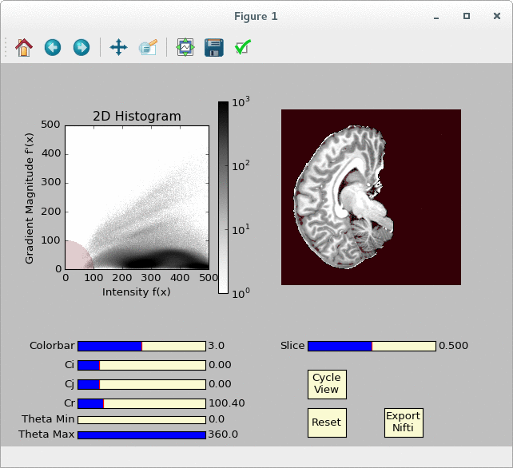

# Segmentator (work in progress) [](https://zenodo.org/badge/latestdoi/24138/ofgulban/segmentator)

Segmentator is an open-source package for multi-dimensional data exploration and segmentation. This application is mainly developed for ultra-high field magnetic resonance imaging (MRI) brain data.

The goal is to provide a complementary tool to the already available tissue segmentation methods (to the best of our knowledge) in other softwares (FSL, Freesurfer, SPM, Brainvoyager, ITK-Snap, MIPAV).

This application is based on the following work:

* Kindlmann, G., & Durkin, J. W. (1998). Semi-automatic generation of transfer functions for direct volume rendering. In Proceedings of the 1998 IEEE symposium on Volume visualization - VVS ’98 (pp. 79–86). New York, New York, USA: ACM Press. http://doi.org/10.1145/288126.288167

* Kniss, J., Kindlmann, G., & Hansen, C. (2001). Interactive volume rendering using multi-dimensional transfer functions and direct manipulation widgets. In Proceedings Visualization, 2001. VIS ’01. (pp. 255–562). IEEE. http://doi.org/10.1109/VISUAL.2001.964519

* Kniss, J., Kindlmann, G., & Hansen, C. (2002). Multidimensional transfer functions for interactive volume rendering. IEEE Transactions on Visualization and Computer Graphics, 8(3), 270–285. http://doi.org/10.1109/TVCG.2002.1021579

* Kniss, J., Kindlmann, G., & Hansen, C. D. (2005). Multidimensional transfer functions for volume rendering. Visualization Handbook, 189–209. http://doi.org/10.1016/B978-012387582-2/50011-3

* Ip, C. Y., Varshney, A., & Jaja, J. (2012). Hierarchical exploration of volumes using multilevel segmentation of the intensity-gradient histograms. IEEE Transactions on Visualization and Computer Graphics, 18(12), 2355–2363. http://doi.org/10.1109/TVCG.2012.231


## Dependencies

- [Python 2.7](https://www.python.org/download/releases/2.7/)
- [NumPy](http://www.numpy.org/)
- [matplotlib](http://matplotlib.org/)
- [NiBabel](http://nipy.org/nibabel/)

##### Optional
- [scikit-image](http://scikit-image.org/), for normalized graph cuts. However you should install it from [this fork](https://github.com/ofgulban/scikit-image) for the required functionality. If you are scared of messing up your current python modules consider using [miniconda](http://conda.pydata.org/miniconda.html) with [virtual python environments](http://conda.pydata.org/docs/using/envs.html).

## How to use

Open a terminal, navigate to Segmentator's folder (for instance: `cd /home/john/segmentator/` ) and type ```python segmentator.py -h``` to see the usage and all the available options.

To load data simply write:
```bash
python segmentator.py /path/to/your/file.nii.gz
```

You should see a window appearing soon after. Try dragging the red circle around, you can even draw directly on the histogram:




## Support

Please use [GitHub issues](https://github.com/ofgulban/segmentator/issues) for bug reports and feature requests.


## License

The project is licensed under [GNU Geneal Public License Version 3](http://www.gnu.org/licenses/gpl.html).
